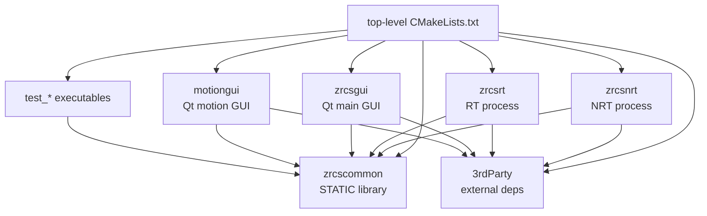
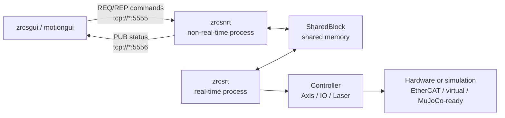
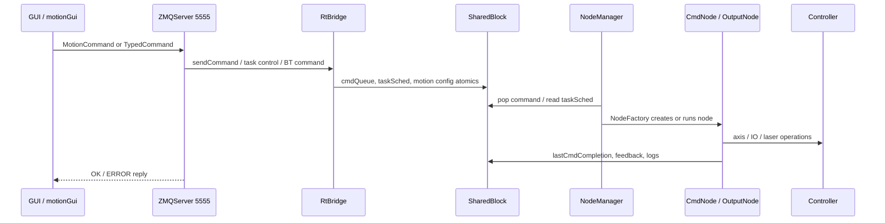
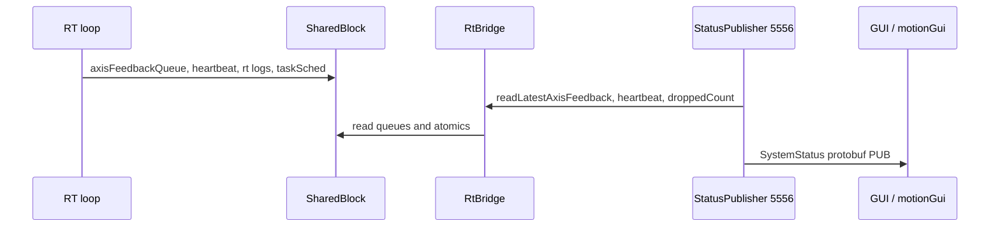
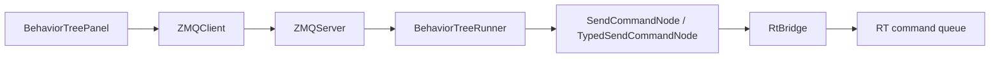
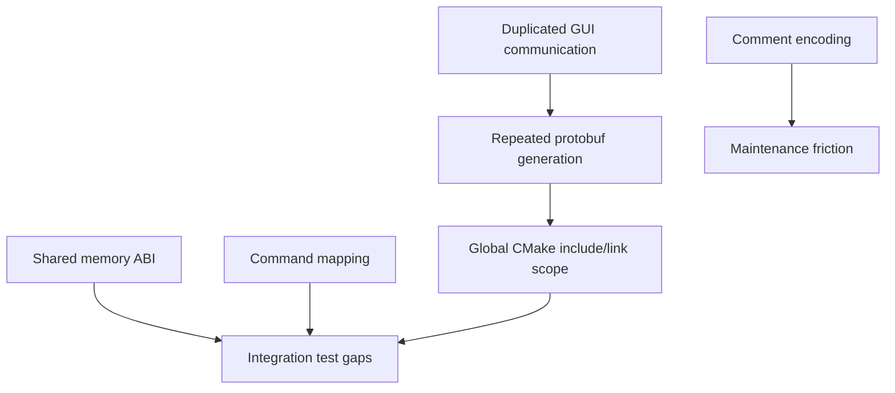

# ZRCS 全项目架构分析

本文档文件: `docs/architecture-analysis.md`

## 1. 分析范围

本文聚焦本项目自有代码:

- `zrcs_common`: 公共配置、共享内存、protobuf 消息。
- `zrcs_nrt`: 非实时进程，负责 GUI 命令入口、行为树、运动预处理、RT 桥接、状态发布。
- `zrcs_rt`: 实时进程，负责实时循环、命令节点、控制器、模型、硬件或仿真后端。
- `zrcs_gui`: Qt 主 GUI，包含行为树、轨迹、命令、状态面板。
- `motionGui`: 轻量运动控制 GUI。
- `test`: 当前测试目标。
- 顶层 CMake 与 `cmake/`: 构建模式和第三方依赖入口。

`3rdParty` 不做内部审计，只作为外部依赖边界记录。当前工作区没有 Foxglove WebSocket 代码，Foxglove 可视化应作为后续单独功能规划。

## 2. 构建模块图

顶层 `CMakeLists.txt` 以 `BUILD_MODE` 控制构建范围:

- `standard`: 默认模式，构建 common、NRT、RT、GUI、motionGui、测试。
- `realtime`: 不构建 Groot、GUI、motionGui，仅构建 NRT/RT 等实时部署相关目标。
- `simulation`: 在运动控制库中追加仿真后端依赖。

| Target | Source boundary | Main role | Key dependencies |
| --- | --- | --- | --- |
| `zrcscommon` | `zrcs_common` | 配置、共享内存、公共消息 | Boost headers, tinyxml2, cereal, magic_enum |
| `zrcsnrt` | `zrcs_nrt` | 上位机命令入口、RT 桥接、状态发布 | zrcscommon, Protobuf, cppzmq, BehaviorTree.CPP, Ruckig |
| `zrcsrt` | `zrcs_rt` | 实时控制循环、命令节点、硬件/仿真控制 | zrcscommon, Eigen, Ruckig, tinyxml2 |
| `zrcsgui` | `zrcs_gui` | 主 GUI、行为树编辑/下发、状态面板 | Qt6, Protobuf, cppzmq, Groot |
| `motiongui` | `motionGui` | 轻量运动 GUI | Qt6, Protobuf, cppzmq |
| `test_*` | `test` | SPSC、命令、配置、轴方向、ZMQ 通信测试 | zrcscommon, Protobuf, cppzmq |

## 3. 运行进程图

运行时主链路是 GUI 或 motionGui 连接 NRT，NRT 启动并桥接 RT，RT 连接控制器后端。

NRT 入口 `zrcs_nrt/main.cpp` 的职责:

- 初始化日志和项目配置。
- 创建共享内存段。
- 启动 RT 子进程 `zrcsrt`。
- 等待 RT 写入共享内存 magic。
- 创建 `RtBridge`、`BehaviorTreeRunner`、`ZMQServer`、`StatusPublisher`。
- 收到停止信号时通知 RT 关闭，必要时强制结束子进程。

RT 入口 `zrcs_rt/main.cpp` 的职责:

- 在 Linux 下尝试锁内存，在 Windows 下设置控制台编码。
- 解析项目配置。
- 创建 `NodeManager` 并进入 RT 控制循环。
- 监控共享内存中的 `TaskScheduling::SHUTDOWN`，收到后退出。

## 4. 核心数据流

### 4.1 命令流

命令入口有两层:

- GUI 到 NRT: `zrcs_message::MotionCommand` 和 `zrcs_message::TypedCommand`。
- NRT 到 RT: `zrcs::Command`，通过 `cmdId + args[] + seq` 写入 `SharedBlock::cmdQueue`。

### 4.2 状态流

状态出口目前是 ZMQ PUB:

- 端口: `tcp://*:5556`
- 频率: `StatusPublisher` 中 10 ms 周期
- 消息: `zrcs_message::SystemStatus`
- GUI 订阅者: `ZMQStatusSubscriber` 和 `MotionStatusSubscriber`

### 4.3 行为树流

行为树在 NRT 内部运行，tick 周期约 20 ms。行为树节点不直接操作 RT 数据结构，而是通过 `RtBridge` 发送命令并轮询命令完成状态。

### 4.4 运动预处理流

`MotionPreprocessor` 位于 NRT 侧，用于把离散路径转换成 RT 可执行的分段命令:

- `PathPreprocessor`: 路径拟合、重采样能力。
- `VelocityPlanner3D`: 速度前瞻、拐角限速。
- `RtBridge`: 发送 `MoveL` 或 `MoveLGalvo`，并同步路径运动参数。

当前实现的主路径是按相邻 waypoint 发送 `MoveL`/`MoveLGalvo` 分段命令，而不是把完整轨迹直接作为一个高层消息交给 RT。

## 5. 稳定接口

以下文件是架构稳定点。修改它们需要同步考虑协议、ABI、测试和调用方。

| Interface | Role | Stability concern |
| --- | --- | --- |
| `zrcs_common/message/message.proto` | GUI/NRT ZMQ protobuf 协议 | 字段编号必须保持兼容，新增字段优先追加 |
| `zrcs_common/shared_memory/ShmLayout.h` | NRT/RT 共享内存唯一真相源 | 布局变化必须 bump `kShmVersion` 并验证 size |
| `zrcs_common/config/CmdDefine.h` | 命令名、`CmdId`、参数枚举映射 | 必须与 RT command node、BT alias 保持一致 |
| `zrcs_nrt/rtBridge/RtBridge.h` | NRT 访问 `SharedBlock` 的统一边界 | 保证 SPSC 单生产者语义和线程安全 |
| `zrcs_nrt/zmq_server/ZmqServer.h` | GUI 命令入口 | 维护 REQ/REP 语义和错误回复格式 |
| `zrcs_rt/system/NodeManager.*` | RT 周期调度核心 | 影响任务状态机、命令生命周期、控制器 I/O |
| GUI/motionGui ZMQ client/subscriber | GUI 通信封装 | 当前重复实现，协议变更时需同步两处 |

## 6. 端口与协议表

| Channel | Endpoint | Owner | Payload | Direction |
| --- | --- | --- | --- | --- |
| Command REQ/REP | `tcp://*:5555` | `ZMQServer` | `MotionCommand` or `TypedCommand` | GUI -> NRT -> GUI |
| Status PUB/SUB | `tcp://*:5556` | `StatusPublisher` | `SystemStatus` | NRT -> GUI |
| Command queue | `SharedBlock::cmdQueue` | `RtBridge` / `NodeManager` | `zrcs::Command` | NRT -> RT |
| Log queue | `SharedBlock::logQueue` | RT log / NRT log consumer | `RtLogEntry` | RT -> NRT |
| Axis feedback queue | `SharedBlock::axisFeedbackQueue` | RT / `StatusPublisher` | `AxisFeedbackData` | RT -> NRT |
| Latest snapshots | `LockFreeLatest<T>` fields | RT / NRT | position, FK, probe, capture, heartbeat | RT -> NRT |

## 7. 共享内存责任表

| SharedBlock area | Writer | Reader | Notes |
| --- | --- | --- | --- |
| `cmdQueue` | NRT `RtBridge` | RT `NodeManager` | SPSC, NRT uses mutex to preserve single producer semantics |
| `logQueue` | RT logging | NRT log consumer/status path | SPSC |
| `axisFeedbackQueue` | RT control loop | NRT `StatusPublisher` | SPSC, preserves frame sequence |
| `taskSched` | NRT and RT | NRT and RT | Atomic task state, used for run/stop/reset/shutdown |
| `axisCount`, config atomics | NRT/config initialization | RT/NRT | Runtime configuration |
| `lastCmdCompletion` | RT | NRT / BT nodes | Packed seq/result in atomic `uint64_t` |
| `axisPositions`, `fkResult`, etc. | RT | NRT | `LockFreeLatest<T>` three-slot seqlock |
| `pathMoveCfg`, `galvoCfg` | NRT | RT MoveL / MoveLGalvo nodes | Motion limits and galvo/platform coordination |

## 8. 依赖风险图

| Risk | Why it matters | Recommended control |
| --- | --- | --- |
| Shared memory ABI drift | NRT and RT map the same bytes in separate processes | Add ABI size/version tests, bump `kShmVersion` on layout changes |
| Command registry split | `CmdDefine`, RT node registration, BT alias registration can drift | Add command consistency test and one generated registry source |
| GUI communication duplication | `zrcs_gui` and `motionGui` each own ZMQ client/subscriber logic | Extract shared GUI communication library or shared QObject workers |
| Protobuf generated per target | Same proto generated in NRT, RT, GUI, motionGui, tests | Create one generated proto target or common wrapper |
| Global include/link scope | Broad include paths can hide dependency leaks | Prefer target-scoped include/link declarations |
| Chinese comment encoding display issues | Terminal output shows mojibake in multiple files | Normalize source files to UTF-8 and document editor settings |
| Status publisher CSV side effect | `StatusPublisher` writes `axis_log.csv` during runtime | Make diagnostics output configurable or move to explicit logging module |

## 9. 重构路线图

### Phase 1: 固化架构与协议事实

- 保持本文档随代码更新。
- 补充端口表、共享内存字段责任表、命令生命周期图。
- 给 `ShmLayout.h` 增加 ABI 变更规则说明: 字段增删改必须 bump `kShmVersion`。

### Phase 2: 抽出共享通信层

- 将 GUI 和 motionGui 重复的 ZMQ REQ/REP client、PUB/SUB subscriber 抽成共享 Qt 通信模块。
- 保留现有信号语义，先替换内部实现，避免 UI 大改。
- 将 host/port/timeout/reconnect 策略集中配置。

### Phase 3: 集中命令注册与校验

- 以 `CmdDefine.h` 或生成文件作为命令名、`CmdId`、参数枚举的唯一输入。
- 自动校验 RT `NodeFactory` 注册命令覆盖所有已实现 `CmdId`。
- 自动校验 `BehaviorTreeRunner` 注册的 typed alias 与命令表一致。

### Phase 4: 收敛 Protobuf 和 CMake 边界

- 为 `message.proto` 建立单一 generated proto target。
- NRT、RT、GUI、motionGui、test 全部链接该 target。
- 减少顶层 `include_directories`，迁移到 `target_include_directories`。

### Phase 5: 补齐回归测试

- 新增共享内存 ABI 测试: `sizeof(ShmHeader)`、`sizeof(SharedBlock)`、`kShmVersion`、关键字段 offset。
- 新增命令一致性测试: `CmdId`、命令名、RT node、BT alias。
- 新增 ZMQ 协议测试: MotionCommand、TypedCommand、SystemStatus 的端到端解析。
- 新增 GUI 通信层单元测试或最小集成测试，覆盖重连和错误回复。

## 10. 当前测试目标覆盖

| Test target | Current coverage |
| --- | --- |
| `test_spsc` | SPSC ring/shared queue behavior |
| `test_command` | Command structure and command safety checks |
| `test_config_manager` | ConfigManager loading and validation |
| `test_axis_direction` | Axis/controller direction behavior |
| `test_zmq_comm` | Protobuf + ZMQ REQ/REP communication |

建议新增:

- `test_shm_abi`: 共享内存 ABI size/version/offset。
- `test_command_registry`: 命令注册一致性。
- `test_status_pubsub`: `SystemStatus` 发布/订阅协议回归。
- `test_gui_comm_worker`: GUI 通信 worker 的重连、超时、错误回复。

## 11. CodeGraph 记录

本次分析过程中曾初始化 CodeGraph:

- Indexed files: 2074
- Nodes: 57888
- Edges: 126469
- Cache path: `.codegraph/`

随后原始 `codegraph.cmd` 路径失效，因此本文档以 CodeGraph 已取得的统计信息为背景，并以 CMake、入口文件、`rg` 静态检索结果作为最终依据。`.codegraph/` 是分析缓存，不应提交到版本库。
