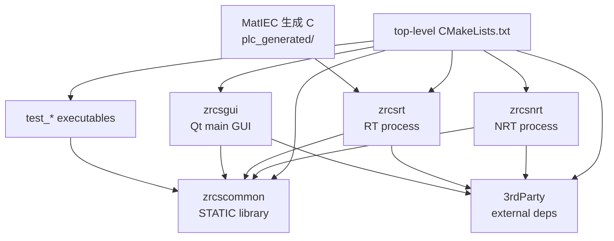
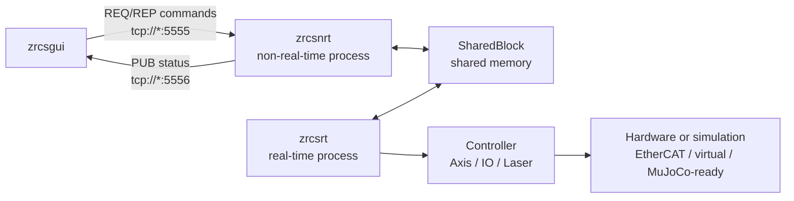
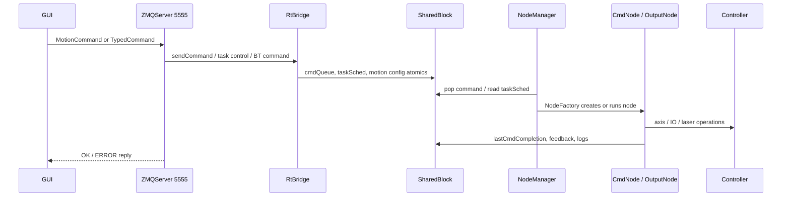
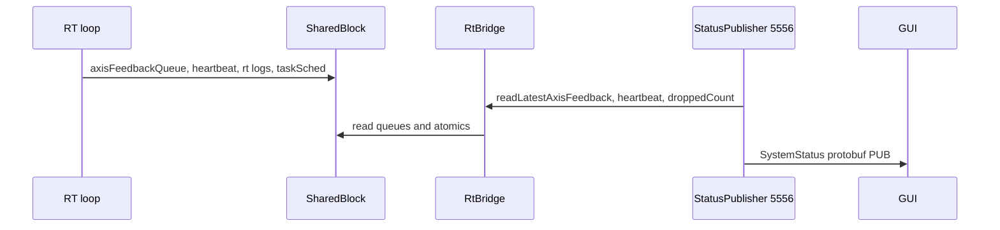
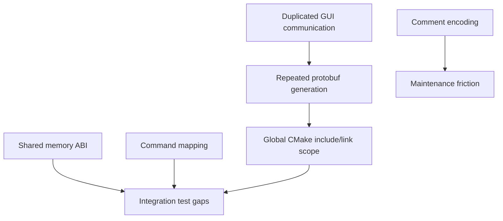

# ZRCS 全项目架构分析

本文档文件: `docs/architecture-analysis.md`

## 1. 分析范围

本文聚焦本项目自有代码:

- `zrcs_common`: 公共配置、共享内存、protobuf 消息。
- `zrcs_nrt`: 非实时进程，负责 GUI 命令入口、行为树、运动预处理、RT 桥接、状态发布。
- `zrcs_rt`: 实时进程，负责实时循环、命令节点、控制器、模型、硬件或仿真后端。
- `zrcs_gui`: Qt 主 GUI，包含行为树、命令、状态面板。
- `test`: 当前测试目标。
- 顶层 CMake 与 `cmake/`: 构建模式和第三方依赖入口。

> **本次修订（2026-10-09）**：原文多处提到的 `motionGui` 与 `PathPreprocessor` 已从仓库移除，
> 相关描述已删除或标注；新增「未完成功能」章节记录当前真实缺口。修订依据为对
> `CMakeLists.txt`、`zrcs_*` 源码与 `config/` 的静态检索，未改动任何代码。

`3rdParty` 不做内部审计，只作为外部依赖边界记录。当前工作区没有 Foxglove WebSocket 代码，Foxglove 可视化应作为后续单独功能规划。

## 2. 构建模块图

顶层 `CMakeLists.txt` 以 `BUILD_MODE` 控制构建范围:

- `standard`: 默认模式，构建 common、NRT、RT、GUI、测试。
- `realtime`: 不构建 Groot、GUI，仅构建 NRT/RT 等实时部署相关目标。
  **注意：当前无法构建** —— 该模式链接的 `ethercat_rtdm` 目标在仓库内无任何定义（见第 12 节）。
- `simulation`: 在运动控制库中追加仿真后端依赖。

```mermaid
flowchart TD
    Root["top-level CMakeLists.txt"]
    Common["zrcscommon<br/>STATIC library"]
    NRT["zrcsnrt<br/>NRT process"]
    RT["zrcsrt<br/>RT process"]
    PLC["MatIEC 生成 C<br/>plc_generated/"]
    GUI["zrcsgui<br/>Qt main GUI"]
    Tests["test_* executables"]
    ThirdParty["3rdParty<br/>external deps"]

    Root --> Common
    Root --> ThirdParty
    Root --> NRT
    Root --> RT
    Root --> GUI
    Root --> Tests
    PLC --> RT

    NRT --> Common
    RT --> Common
    GUI --> Common
    Tests --> Common
    NRT --> ThirdParty
    RT --> ThirdParty
    GUI --> ThirdParty
```

| Target | Source boundary | Main role | Key dependencies |
| --- | --- | --- | --- |
| `zrcscommon` | `zrcs_common` | 配置、共享内存、公共消息 | Boost headers, cereal, magic_enum |
| `zrcsnrt` | `zrcs_nrt` | 上位机命令入口、RT 桥接、状态发布 | zrcscommon, Protobuf, cppzmq, BehaviorTree.CPP, Ruckig |
| `zrcsrt` | `zrcs_rt` + `build/zrcs_rt/plc_generated` | 实时控制循环、命令节点、硬件/仿真控制、MatIEC 软 PLC 扫描 | zrcscommon, Eigen, Ruckig |
| `zrcsgui` | `zrcs_gui` | 主 GUI、行为树编辑/下发、状态面板 | Qt6, Protobuf, cppzmq, Groot |
| `test_*` | `test` | SPSC、命令、配置、轴方向、ZMQ 通信测试 | zrcscommon, Protobuf, cppzmq |

## 3. 运行进程图

运行时主链路是 GUI 连接 NRT，NRT 启动并桥接 RT，RT 连接控制器后端。

```mermaid
flowchart LR
    GUI["zrcsgui"]
    NRT["zrcsnrt<br/>non-real-time process"]
    RT["zrcsrt<br/>real-time process"]
    SHM["SharedBlock<br/>shared memory"]
    Controller["Controller<br/>Axis / IO / Laser"]
    Hardware["Hardware or simulation<br/>EtherCAT / virtual / MuJoCo-ready"]

    GUI -- "REQ/REP commands<br/>tcp://*:5555" --> NRT
    NRT -- "PUB status<br/>tcp://*:5556" --> GUI
    NRT <--> SHM
    RT <--> SHM
    RT --> Controller
    Controller --> Hardware
```

NRT 入口 `zrcs_nrt/main.cpp` 的职责:

- 初始化日志和项目配置。
- 创建共享内存段。
- 启动 RT 子进程 `zrcsrt`。
- 等待 RT 写入共享内存 magic。
- 创建 `RtBridge`、`BehaviorTreeRunner`、`ZMQServer`、`StatusPublisher`。
- 收到停止信号时通知 RT 关闭，必要时强制结束子进程。

RT 入口 `zrcs_rt/main.cpp` 的职责:

- 在 Linux 下尝试锁内存，在 Windows 下设置控制台编码。
- 解析项目配置。
- 创建 `NodeManager` 并进入 RT 控制循环。
- 监控共享内存中的 `TaskScheduling::SHUTDOWN`，收到后退出。

## 4. 核心数据流

### 4.1 命令流

```mermaid
sequenceDiagram
    participant GUI as GUI
    participant ZMQ as ZMQServer 5555
    participant Bridge as RtBridge
    participant SHM as SharedBlock
    participant RT as NodeManager
    participant Node as CmdNode / OutputNode
    participant HW as Controller

    GUI->>ZMQ: MotionCommand or TypedCommand
    ZMQ->>Bridge: sendCommand / task control / BT command
    Bridge->>SHM: cmdQueue, taskSched, motion config atomics
    RT->>SHM: pop command / read taskSched
    RT->>Node: NodeFactory creates or runs node
    Node->>HW: axis / IO / laser operations
    Node->>SHM: lastCmdCompletion, feedback, logs
    ZMQ-->>GUI: OK / ERROR reply
```

命令入口有两层:

- GUI 到 NRT: `zrcs_message::MotionCommand` 和 `zrcs_message::TypedCommand`。
- NRT 到 RT: `zrcs::Command`，通过 `cmdId + args[] + seq` 写入 `SharedBlock::cmdQueue`。

### 4.2 状态流

```mermaid
sequenceDiagram
    participant RT as RT loop
    participant SHM as SharedBlock
    participant Bridge as RtBridge
    participant Pub as StatusPublisher 5556
    participant GUI as GUI

    RT->>SHM: axisFeedbackQueue, heartbeat, rt logs, taskSched
    Pub->>Bridge: readLatestAxisFeedback, heartbeat, droppedCount
    Bridge->>SHM: read queues and atomics
    Pub->>GUI: SystemStatus protobuf PUB
```

状态出口目前是 ZMQ PUB:

- 端口: `tcp://*:5556`
- 频率: `StatusPublisher` 中 10 ms 周期
- 消息: `zrcs_message::SystemStatus`
- GUI 订阅者: `ZMQStatusSubscriber` 和 `MotionStatusSubscriber`

### 4.3 行为树流

```mermaid
flowchart LR
    Panel["BehaviorTreePanel"]
    Client["ZMQClient"]
    Server["ZMQServer"]
    Runner["BehaviorTreeRunner"]
    BTNode["SendCommandNode / TypedSendCommandNode"]
    Bridge["RtBridge"]
    RT["RT command queue"]

    Panel --> Client
    Client --> Server
    Server --> Runner
    Runner --> BTNode
    BTNode --> Bridge
    Bridge --> RT
```

行为树在 NRT 内部运行，tick 周期约 20 ms。行为树节点不直接操作 RT 数据结构，而是通过 `RtBridge` 发送命令并轮询命令完成状态。

### 4.4 运动预处理流

NRT 侧的路径规划位于 `zrcs_nrt/algorithm/path_planning/`，把离散路径转换成 RT 可执行的分段命令：

- `TrajectoryGeometry` / `PathSimplifier`: 几何计算与共线点折叠。
- `CornerBlender`: 按拐角容差生成直线与圆弧过渡。
- `ShortSegmentMerger`: 合并过短段。
- `LookAheadPlanner` / `MotionPlanner`: 速度前瞻、拐角限速、正反向可达速度。
- `RtBridge`: 发送 `MoveL`/`MovePath` 分段命令，并通过 `setPathMoveConfig()` 同步路径运动参数。

> 原文提到的 `PathPreprocessor`（路径拟合、Bezier 角点混合）**已从仓库删除**，
> `MotionPreprocessor` 中的 `pathFitter_` 成员一并移除，因此不再存在"声明未调用"的死代码问题。

当前实现的主路径是按相邻 waypoint 发送 `MoveL`/`MovePath` 分段命令，而不是把完整轨迹直接作为一个高层消息交给 RT。

## 5. 稳定接口

以下文件是架构稳定点。修改它们需要同步考虑协议、ABI、测试和调用方。

| Interface | Role | Stability concern |
| --- | --- | --- |
| `zrcs_common/message/message.proto` | GUI/NRT ZMQ protobuf 协议 | 字段编号必须保持兼容，新增字段优先追加 |
| `zrcs_common/shared_memory/ShmLayout.h` | NRT/RT 共享内存唯一真相源 | 布局变化必须 bump `kShmVersion` 并验证 size |
| `zrcs_common/config/CmdDefine.h` | 命令名、`CmdId`、参数枚举映射（`ZRCS_MOTION_COMMAND_TABLE` 为唯一事实源） | 必须与 RT command node 保持一致；表条目数由 `static_assert` 与 `CmdId` 数量绑定 |
| `zrcs_nrt/rtBridge/RtBridge.h` | NRT 访问 `SharedBlock` 的统一边界 | 保证 SPSC 单生产者语义和线程安全 |
| `zrcs_nrt/nrtServer/zmq/ZmqServer.h` | GUI 命令入口 | 维护 REQ/REP 语义和错误回复格式 |
| `zrcs_rt/system/NodeManager.*` | RT 周期调度核心 | 影响任务状态机、命令生命周期、控制器 I/O |
| `zrcs_gui/communication/ZmqClient.h`、`ZmqStatusSubscriber.h` | GUI 通信封装 | 当前仅此一份实现（`motionGui` 已移除），协议变更时需与 NRT 同步 |

## 6. 端口与协议表

| Channel | Endpoint | Owner | Payload | Direction |
| --- | --- | --- | --- | --- |
| Command REQ/REP | `tcp://*:5555` | `ZMQServer` | `MotionCommand` or `TypedCommand` | GUI -> NRT -> GUI |
| Status PUB/SUB | `tcp://*:5556` | `StatusPublisher` | `SystemStatus` | NRT -> GUI |
| Command queue | `SharedBlock::cmdQueue` | `RtBridge` / `NodeManager` | `zrcs::Command` | NRT -> RT |
| Log queue | `SharedBlock::logQueue` | RT log / NRT log consumer | `RtLogEntry` | RT -> NRT |
| Axis feedback queue | `SharedBlock::axisFeedbackQueue` | RT / `StatusPublisher` | `AxisFeedbackData` | RT -> NRT |
| Latest snapshots | `LockFreeLatest<T>` fields | RT / NRT | position, FK, probe, capture, heartbeat | RT -> NRT |

## 7. 共享内存责任表

| SharedBlock area | Writer | Reader | Notes |
| --- | --- | --- | --- |
| `cmdQueue` | NRT `RtBridge` | RT `NodeManager` | SPSC, NRT uses mutex to preserve single producer semantics |
| `logQueue` | RT logging | NRT log consumer/status path | SPSC |
| `axisFeedbackQueue` | RT control loop | NRT `StatusPublisher` | SPSC, preserves frame sequence |
| `taskSched` | NRT and RT | NRT and RT | Atomic task state, used for run/stop/reset/shutdown |
| `axisCount`, config atomics | NRT/config initialization | RT/NRT | Runtime configuration |
| `lastCmdCompletion` | RT | NRT / BT nodes | Packed seq/result in atomic `uint64_t` |
| `axisPositions`, `fkResult`, etc. | RT | NRT | `LockFreeLatest<T>` three-slot seqlock |

## 8. 依赖风险图

```mermaid
flowchart TD
    ABI["Shared memory ABI"]
    CmdMap["Command mapping"]
    Proto["Repeated protobuf generation"]
    GuiDup["Duplicated GUI communication"]
    CMake["Global CMake include/link scope"]
    Encoding["Comment encoding"]
    TestGap["Integration test gaps"]

    ABI --> TestGap
    CmdMap --> TestGap
    Proto --> CMake
    GuiDup --> Proto
    CMake --> TestGap
    Encoding --> Maintenance["Maintenance friction"]
```

| Risk | Why it matters | Recommended control |
| --- | --- | --- |
| Shared memory ABI drift | NRT and RT map the same bytes in separate processes | Add ABI size/version tests, bump `kShmVersion` on layout changes |
| Command registry split | `CmdDefine`, RT node registration, BT alias registration can drift | Add command consistency test and one generated registry source |
| Protobuf generated per target | Same proto generated in NRT, RT, GUI, tests | Create one generated proto target or common wrapper |
| Global include/link scope | Broad include paths can hide dependency leaks | Prefer target-scoped include/link declarations |
| Chinese comment encoding display issues | Terminal output shows mojibake in multiple files | Normalize source files to UTF-8 and document editor settings |
| Status publisher CSV side effect | `StatusPublisher` writes `axis_log.csv` during runtime | Make diagnostics output configurable or move to explicit logging module |

## 9. 重构路线图

> 落地状态于 2026-10-09 核对（见第 11 节）。`motionGui` 已从仓库移除，Phase 2 的原始目标因此失去前提。

### Phase 1: 固化架构与协议事实 — 部分完成

- ✅ 补充端口表、共享内存字段责任表（§6、§7）。
- ✅ 给 `ShmLayout.h` 增加 ABI 变更规则说明（字段增删改必须 bump `kShmVersion`）。
- ⬜ 保持本文档随代码更新 —— 本次修订前 §4.4、§5、§7 仍在描述已删除的模块与失效路径，需持续维护。
- ⬜ 命令生命周期图（当前仅为文字流，未成图）。
- ⬜ `MujocoFrameServer` 的 8765 HTTP 端点未纳入端口表。

### Phase 2: 抽出共享通信层 — 未做（前提已消失）

- ⬜ 原目标"抽出 GUI 与 motionGui 重复的 ZMQ 通信"，因 `motionGui` 已不存在，重复实现问题随之消失；剩余价值仅为把 GUI 通信封装移出 `zrcs_gui` 私有目录。
- ⬜ host/port 集中配置未做：端口仍硬编码在 `MainWindow.cpp:509/511/528/535` 等处。timeout/reconnect 已集中在 `ZrcsConfig.h`。

### Phase 3: 集中命令注册与校验 — 部分完成

- ✅ `CmdDefine.h` 的 `ZRCS_MOTION_COMMAND_TABLE` 作为命令名、`CmdId`、参数枚举的唯一事实源，条目数由 `static_assert` 与 `CmdId` 绑定。
- ✅ BT typed alias 由宏从命令表展开（`RegisterNodes.cpp:46-49`），不会漂移。
- ⬜ **未做**：自动校验 RT `NodeFactory`/`CmdHead.h` 注册覆盖所有已实现 `CmdId`。`CmdHead.h:1-7` 自述为手工维护（原 `tool/gen_cmd_registry.py` 已不存在，`CMakeLists.txt:31` 仍残留 `${CMAKE_BINARY_DIR}/generated` 包含路径）。漏加 include 时 `static_assert` 与测试都不报错，只在运行时报 `UNKNOWN_CMD`。

### Phase 4: 收敛 Protobuf 和 CMake 边界 — 部分完成

- ✅ 单一 generated proto target 已建立（`add_library(zrcs_proto)` + `zrcs::proto` 别名），NRT/RT/GUI/test 全部链接它。
- ⬜ 减少顶层 `include_directories`、迁移到 `target_include_directories` **未做**：根 `CMakeLists.txt` 及各子目录仍使用目录级 `include_directories`。

### Phase 5: 补齐回归测试 — 未做

- ⬜ 全库检索 `enable_testing`/`add_test` 零命中：现有 10 个测试目标**未接入 CTest**，没有统一回归入口。
- ⬜ 下列建议测试均不存在：`test_shm_abi`、`test_command_registry`、`test_status_pubsub`、`test_gui_comm_worker`。
- ⬜ 三个孤儿测试源文件未纳入构建：`test/ethercat.cpp`、`test/nrtcmd.cpp`、`test/test_axis_status.cpp`。
- ⬜ 无任何 PLC 相关测试。

## 10. 当前测试目标覆盖

| Test target | Current coverage |
| --- | --- |
| `test_spsc` | SPSC ring/shared queue behavior |
| `test_command` | Command structure and command safety checks |
| `test_config_manager` | ConfigManager loading and validation |
| `test_axis_direction` | Axis/controller direction behavior |
| `test_cartesian_rtcp` | 笛卡尔 RTCP 运动学 |
| `test_motion_preprocessing` | 路径规划管线（简化/圆角/合并/前瞻） |
| `test_xyzac_nc_path` | XYZAC 数控路径解析与规划 |
| `test_zmq_comm` | Protobuf + ZMQ REQ/REP communication（使用自建 mock 服务端） |
| `test_move_v_command_client` | MoveV 命令联调客户端（需 `--execute` 才真正发指令） |
| `test_windows_thread_period` | Windows 线程周期/抖动测量（无 zrcs 依赖） |

说明：

- 上述目标均**未接入 CTest**，需手动逐个运行。
- `test_zmq_comm` 内部启动 mock REP 服务端，**没有一条用例经过真实的 `ZMQServer`/`CommandRouter`/`StatusPublisher`**。
- 未列入上表的孤儿源文件：`test/ethercat.cpp`（且含失效 include 与缺失头文件）、`test/nrtcmd.cpp`、`test/test_axis_status.cpp`。

建议新增:

- `test_shm_abi`: 共享内存 ABI size/version/offset。
- `test_command_registry`: 命令注册一致性（`CmdId` ↔ `CmdHead.h` ↔ NodeFactory）。
- `test_status_pubsub`: `SystemStatus` 发布/订阅协议回归。
- `test_gui_comm_worker`: GUI 通信 worker 的重连、超时、错误回复。
- `test_plc_scan`: PLC 扫描心跳与变量桥一致性。

## 11. 未完成功能清单（2026-10-09 静态检索）

本节记录本轮文档修订时对 `zrcs_*` 源码、`config/` 与构建脚本静态检索得到的真实缺口。
所有条目均有代码位置依据；标注"未确认"的为无法从代码判定的项。

### 12.1 结构性缺口（影响能否上真实硬件）

| 缺口 | 证据 | 影响 |
| --- | --- | --- |
| `realtime` 模式无法配置/构建 | `CMakeLists.txt:72` 在 `BUILD_MODE=realtime` 下链接 `ethercat_rtdm`，该目标在仓库内无任何定义（`cmake/` 下无 target，也无对应库文件）；`cmake/controller.cmake:11-17` 硬编码 `/usr/xenomai/bin/xeno-config` | EtherCAT 后端（`zrcs_rt/controller/ethercat/`）从未被编译链接，从未在真实硬件验证 |
| 总线无健康监测 | `EthercatMaster.h:54/58/61` 声明 `master_state_`/`domain_state_`/`sc_state_` 后从未读取；`receive()`(`:287-292`) 不校验 Working Counter | 从站掉线、丢帧上层无感，`DomainRead` 旧数据被当作实际位置使用。`MC_ERRORCODE_COMMUNICATION`(0x1F0) 全工程无使用点 |
| 安全回路三处为空 | `EthercatMotor.h:151-154` `emergStop(){}` 空函数；`Io.cpp:9-16` `isEmergencyStop(){return false;}`；`zrcs_*` 下检索 `brake`/`抱闸` 零命中 | 急停与被动物理制动均无实现 |
| IO 层未接入控制循环 | `Controller.h:91-92` 是 `void readIo(){}`/`void writeIo(){}`；全工程无调用点；`ios_` 仅在 `addIo()`(`:72-74`) 被 push_back | EtherCAT 上配置的 AIO/DIO/LASER 从站建完即无人驱动；PLC 输出无落点（`plc/PlcOutputNode.cpp:39` TODO） |
| 速度/力矩通路缺失 | 5 个 `config/*/ethercat.xml` 均**不含** `TargetVelocity`/`TargetTorque`/`ActualVelocity`/`ActualTorque` PDO；`EthercatMotor.h:96-106` 两个 TODO 空实现、`:133-136` 力矩读取恒 0 | 即使补代码也无 PDO 通道，须先改配置 |
| 参数读写缺失 | `EthercatMotor` 未重写 `readVal`/`writeVal`，落到 `Servo.cpp:68-76` 的 `return false` | SDO 参数读写无通道，诊断/调参不可用 |
| 无回零流程 | `Movehome.cpp:52-63` 仅为"走到 0"的 Ruckig 运动；全工程无 `setAxisState(Homing)` 调用，`Cia402Mode::HOMING`(`Servo.h:45`) 未使用 | 无原点开关/Z 相搜索、无回零偏移 |
| 硬限位缺失 | 检索 `limitSwitch`/`homeSwitch` 零命中；软限位要求 `posPositiveLimit > posNegativeLimit`(`Axis.cpp:107-109`) 才生效，配反或留 0 静默跳过，`ConfigManager::validate()` 不校验 | 限位配置错误无任何提示 |
| 传感器为空 | `EthercatSensor.h` 全文仅 `#pragma once`（13 字节）；`ShmLayout.h` 的 `probeResult`/`captureResult` 槽位在 RT 侧**无写入者** | 测头/相机采集数据恒为空 |
| 死配置字段 | `servo.xml` 的 `homePos`/`posOffset`/`velFactor` 全仓无读取点；`AxisPara::frequency` 从未被赋值 | 安装偏置、回零位置、速度前馈不生效 |

### 12.2 PLC：仅 P0 演示级

详见 `docs/matiec-rt-integration.md`（P0 已落地）与 `docs/plc-variable-channel.html`（P1-P3 自述"未实施"）。

- 无 `PlcIoMapping`（`plc/` 下只有三个节点 + `PlcProgram.h`），映射为硬编码字段赋值。
- PLC 输出不驱动物理 IO，仅做 `Q_RUNNING` 边沿日志。
- 变量无对外通道：`ShmLayout.h` 检索 `plc` 零命中，`kShmVersion` 仍为 16。
- GUI 无 PLC 面板：`zrcs_gui` 全树 `plc` 仅 4 处命中，且全部是 `EtherCATPanel` 引用 OpenPLC Editor 的注释。
- 无扫描心跳输出，因此"PLC 是否在扫描"无法从日志证明。

### 12.3 上位机 / NRT

| 缺口 | 证据 | 影响 |
| --- | --- | --- |
| 命令覆盖不全 | 17 个 `CmdId` 与 `CmdHead.h` 一一对应（17↔17 无缺口，且不存在 `CMD_RESERVE` 枚举值）；但 GUI 预设仅 6 个（`command_panel.ui` 的 `presetCommand`：Enable/Disable/Reset/SetZero/JogabsJ/JogJ） | `Setmode`、`MoveAbs`、`MoveC`、`MoveCurve`、`MovePath`、`MoveExcite`、`MoveV` 共 7 个命令零入口；`MoveJ`/`MoveAbsJ` 仅经 `MujocoFrameServer` HTTP 调试口暴露 |
| 通信层半可靠 | `ZmqStatusSubscriber.cpp:34-38` 订阅失败即 return，无重连；`RtBridge::isRtAlive()`(`RtBridge.cpp:197`) 零调用；`RtBridge` 的 `waitForCompletion`/`readFkResult`/`readProbeResult`/`ioReadResult` 等 10 个方法完整实现但零调用者 | RT 死亡后 NRT 仍发布最后一次 heartbeat，GUI 无感；FK/探针/IO 读取结果无法到达上位机 |
| 命令回复不可见 | `ZmqClient::replyReceived` 有 emit 无消费者；`MainWindow` 只连 `errorOccurred` | NRT 的 `ERROR: Unknown command` 等回复对操作员不可见 |
| 状态栏死标签 | `MainWindow.cpp:105/106` 的 `etherCATStatusLabel`/`homedLabel` 只被 `addPermanentWidget`，全工程无 `setText` | 永远显示"EtherCAT: 未连接"与"归零: 否"，具误导性 |
| 急停语义不完整 | `SYS_ESTOP` 直接映射 `requestStop()`；`MainWindow::showConfirmDialog`(`:392-400`) 零调用；`StatusIndicator::EStop` 零设置；`ZrcsConfig.h` 的 `confirmHoming/confirmEStop/confirmReset`、`softLimitMin/Max`、`homingTimeoutMs` 等 9 组为死配置 | 无二次确认、无软限位校验、急停指示灯不亮 |
| 配置系统未接线 | GUI 的 `Config::load()`（`ZrcsConfig.h:135`）全工程零调用；`MainWindow.cpp:498-501` 反而在连接时 `save()`，用默认值覆盖配置文件；端口 5555/5556 硬编码于 `MainWindow.cpp:509/511/528/535` | 用户配置不生效且会被覆盖 |
| EtherCAT 面板四个关键动作不通 | 设备库为硬编码 12 条假设备(`EtherCATPanel.cpp:38/49-62`)；在线扫描为模拟(`:598-614`)；`onAddSelectedDevices`(`:616`) 未在 `setupConnections` 中连接；下发时 `MainWindow.cpp:301-307` 丢弃 XML 且发送未注册的 `ET_CONFIG` | 面板"看起来能用"，实际扫描/添加/下发全不通，风险高于明显空壳 |
| 无 RT 存活监控 | 同上门（`isRtAlive` 零调用）；`ServiceContainer.cpp:81-84` 状态发布器初始化失败被降级为 warn 后继续 | 界面可能完全静止且无任何提示 |
| 测试未接入 CTest | 全库检索 `enable_testing`/`add_test` 零命中 → 10 个测试目标无统一回归入口 | 无自动化回归；`test_zmq_comm.cpp` 使用自建 mock 服务端，无一条用例经过真实 `ZMQServer`/`CommandRouter`/`StatusPublisher` |

### 12.4 协议定义与实际使用不一致

- `AxisStatus.planner_velocity`(`message.proto:89`) 全工程无 `set_` 点，是唯一完全未实现的字段。
- `MoveJCommand`/`MoveLCommand`/`MoveCCommand`/`JogCommand`/`IOCommand` 五个细化消息定义了但零使用，`TypedCommand` 的 7 个分支实际只用 `bt_command`；GUI 主通道仍是字符串 + `double[]` 的 `MotionCommand`。
- `RtLogStatus.file`/`.line` 由 NRT 填充但 GUI 丢弃；`AxisStatus.torque`/`.cmd_velocity`、`SystemStatus.dropped_commands` 被发布但 GUI 不消费。
- 类型不一致：`message.proto:84` 为 `int32 axis_id`，`StatusPublisher.cpp:37` 以 `uint8_t` 写入。

### 12.5 测试与死代码

- 孤儿测试源文件（存在于目录但未加入 `test/CMakeLists.txt`）：`test/ethercat.cpp`、`test/nrtcmd.cpp`、`test/test_axis_status.cpp`。
- 孤儿命令文件：`zrcs_rt/command/MoveSine.h` 含 `REGISTERCMD(MoveSine)`，但不在 `CmdDefine.h` 枚举/命令表中，也不在 `CmdHead.h` include 列表 → 永不参与 RT 注册。
- 死代码：`zrcs_rt/controller/rtos/PreemptRt.h` 引用不存在的 `controller/Controller_Interface.h`，且全工程无引用。
- `zrcs_gui/core/MainWindowModern.h` 存在但不在构建清单中。
- `zrcs_gui/modules/trajectory/` 为空目录。
- 构建树残留：`build/zrcs_rt/plc_generated/` 仍有 PLC 改名前的 `PlcCfg.c`/`Res0.c`/`plc_demo.st`。

## 12. CodeGraph 记录

本次分析过程中曾初始化 CodeGraph:

- Indexed files: 2074
- Nodes: 57888
- Edges: 126469
- Cache path: `.codegraph/`

随后原始 `codegraph.cmd` 路径失效，因此本文档以 CodeGraph 已取得的统计信息为背景，并以 CMake、入口文件、`rg` 静态检索结果作为最终依据。`.codegraph/` 是分析缓存，不应提交到版本库。
