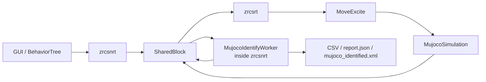

# MuJoCo 在线辨识设计文档

本文档定义 ZRCS 中 MuJoCo 仿真在线辨识的第一版方案。当前实现采用 `zrcsnrt` 进程内 worker，不再新增独立辨识进程；后续开发继续按本文拆成多个小阶段推进。

## 1. 背景与目标

当前 ZRCS 已经在 `BUILD_MODE=simulation` 下接入 MuJoCo 后端，OpenArm 项目通过 `config/openArm/mujoco.xml` 将 ZRCS 轴映射到 MuJoCo joint。用户轨迹能驱动 MuJoCo 模型运动，但存在跟踪慢、过冲、到位振荡等问题。

在线辨识的目标是让仿真模型在运行时自动估计关节等效动力学参数，并基于估计结果调节 MuJoCo actuator 和 joint 参数，从而改善仿真跟踪效果。

第一版范围：

- 只做 MuJoCo 仿真内在线辨识。
- 不接 EtherCAT 实机力矩或电流。
- 不覆盖原始 `config/<project>/mujoco/robot.xml`。
- 不做完整 link mass、COM、inertia 优化。
- 优先辨识和调节关节等效参数：`J`、`B`、`Fc`、`bias`、`kp`、`kv`。

第一版产物：

- `MoveExcite` 激励轨迹指令。
- MuJoCo 辨识样本通道。
- NRT 在线辨识 worker。
- 在线调参通道。
- CSV、`report.json`、`mujoco_identified.xml`。

## 2. 总体架构

在线辨识拆成 RT 和 NRT 两层。RT 线程只做确定耗时工作，NRT 线程做矩阵估计、统计、调参和文件输出。



控制周期内的顺序：

1. RT 从命令队列取到 `MoveExcite`。
2. `MoveExcite` 每周期生成 `qcmd/dqcmd/ddqcmd`。
3. Controller 将位置命令写给 MuJoCo servo。
4. `MujocoBus::send()` 推进一次 MuJoCo step。
5. MuJoCo 后端采样 `q/dq/ddq/tau/ctrl/saturation`。
6. RT 将样本写入共享内存 SPSC 队列。
7. NRT worker 消费样本，执行在线 RLS 和实时指标计算。
8. NRT worker 可按周期发送参数更新请求。
9. RT 在 MuJoCo step 安全点应用参数更新。

实时边界：

- RT 可以做：轨迹公式计算、MuJoCo step、固定字段采样、无锁队列 push、参数限幅应用。
- RT 不做：SVD、批量最小二乘、网格搜索、CSV 写入、XML 写入、日志高频打印。
- NRT 可以做：RLS、窗口统计、CSV、报告、调参决策、导出 XML。

## 3. 数据流与字段语义

### 3.1 样本结构

后续实现新增共享内存结构 `MujocoIdentSampleData`。建议字段如下：

```cpp
struct MujocoIdentSampleData {
    uint64_t seq;
    uint32_t sessionId;
    uint32_t axisCount;
    double timeSec;

    double qCmd[kAxisMax];
    double dqCmd[kAxisMax];
    double ddqCmd[kAxisMax];

    double q[kAxisMax];
    double dq[kAxisMax];
    double ddq[kAxisMax];

    double tauApplied[kAxisMax];
    double tauInverse[kAxisMax];
    double ctrl[kAxisMax];

    uint64_t saturationMask;
    uint64_t validMask;
};
```

`kAxisMax` 继续使用 `zrcs_common/shared_memory/ShmLayout.h` 中的全局上限。

### 3.2 字段来源

| 字段 | 来源 | 单位 | 采样时机 | 说明 |
| --- | --- | --- | --- | --- |
| `qCmd` | `MoveExcite` 解析轨迹 | ZRCS 用户单位，OpenArm 为 rad | 写入 axis 命令时 | 目标位置 |
| `dqCmd` | `MoveExcite` 解析轨迹 | 用户单位/s | 写入 axis 命令时 | 目标速度，不用差分 |
| `ddqCmd` | `MoveExcite` 解析轨迹 | 用户单位/s^2 | 写入 axis 命令时 | 目标加速度，不用差分 |
| `q` | MuJoCo `data->qpos[qposAdr]` | 用户单位 | `mj_step` 后 | 实际位置 |
| `dq` | MuJoCo `data->qvel[dofAdr]` | 用户单位/s | `mj_step` 后 | 实际速度 |
| `ddq` | MuJoCo `data->qacc[dofAdr]` | 用户单位/s^2 | `mj_step` 后 | 实际加速度 |
| `tauApplied` | `qfrc_actuator[dofAdr] + qfrc_applied[dofAdr]` | Nm 或 N | `mj_step` 后 | 当前施加到关节自由度上的力/力矩 |
| `tauInverse` | scratch `mjData` 调 `mj_inverse` 后读 `qfrc_inverse[dofAdr]` | Nm 或 N | `mj_step` 后 | 由当前 `q/dq/ddq` 反算的逆动力学力/力矩 |
| `ctrl` | `data->ctrl[actuatorId]` | actuator 控制单位 | `mj_step` 后 | position actuator 下通常为目标位置 |
| `saturationMask` | actuator/joint force limit 检查 | bit mask | `mj_step` 后 | 该轴力矩饱和时置位 |
| `validMask` | 样本有效性检查 | bit mask | 发布前 | 数据正常、未 NaN、轴映射存在时置位 |

注意事项：

- 单自由度 hinge/slide joint 中，`qpos` 使用 `qposAdr`，`qvel/qacc/qfrc` 使用 `dofAdr`。
- 反馈速度和加速度不从位置差分得到，直接使用 MuJoCo `qvel/qacc`。
- 指令速度和加速度不从 `qCmd` 差分得到，直接使用激励轨迹解析导数。
- `tauInverse` 使用 scratch data 计算，不能直接污染主仿真的 `mjData`。

### 3.3 scratch `mj_inverse`

为避免修改主仿真状态，`MujocoSimulation` 内部维护一个 scratch `mjData`：

1. 将主 `data` 的 `qpos/qvel/qacc/ctrl` 拷贝到 scratch。
2. 调用 `mj_inverse(model, scratchData)`。
3. 读取 `scratchData->qfrc_inverse[dofAdr]`。
4. 不把 scratch 的任何状态写回主 `data`。

参考 MuJoCo 官方接口：

- `mj_inverse`：https://mujoco.readthedocs.io/en/stable/APIreference/APIfunctions.html
- XML joint/actuator 参数：https://mujoco.readthedocs.io/en/stable/XMLreference.html

## 4. 激励轨迹指令 `MoveExcite`

### 4.1 指令定位

`MoveExcite` 是一个 RT 命令节点，直接继承 `zrcsSystem::CmdNode`。它不继承 `TrajectoryCmd`，因为它不是 Ruckig 点到点规划，而是按时间解析生成连续多频轨迹。

第一版只支持单轴激励。多轴辨识通过行为树或 NRT worker 顺序发送多个 `MoveExcite`。

### 4.2 参数定义

后续在 `CmdDefine.h` 中新增：

```cpp
enum class MoveExciteArg : std::size_t {
    AxisId = 0,
    Duration,
    Amplitude,
    CenterOffset,
    F1, F2, F3, F4, F5,
    Phase1, Phase2, Phase3, Phase4, Phase5,
    RampTime,
    VelScale,
    AccScale,
    SessionId
};
```

参数含义：

| 参数 | 默认值 | 单位 | 说明 |
| --- | --- | --- | --- |
| `AxisId` | 必填 | axis id | 要激励的 ZRCS 轴 |
| `Duration` | `20.0` | s | 激励持续时间 |
| `Amplitude` | `0.15` | 用户单位 | 正弦总幅值，OpenArm 为 rad |
| `CenterOffset` | `0.0` | 用户单位 | 相对起点的中心偏置 |
| `F1..F5` | `0.15,0.35,0.7,1.1,1.7` | Hz | 多频正弦频率 |
| `Phase1..Phase5` | `0,1.3,2.1,0.7,2.8` | rad | 相位，避免多个频率峰值同相叠加 |
| `RampTime` | `1.0` | s | 淡入淡出时间 |
| `VelScale` | `0.5` | ratio | 相对轴 `maxVel` 的速度安全系数 |
| `AccScale` | `0.5` | ratio | 相对轴 `maxAcc` 的加速度安全系数 |
| `SessionId` | `0` | id | 辨识会话 id，写入样本数据 |

参数小于等于 0 时的处理：

- `Duration <= 0`：使用默认 `20.0`。
- `Amplitude <= 0`：初始化失败。
- `RampTime <= 0`：使用默认 `1.0`。
- `VelScale <= 0`：使用默认 `0.5`。
- `AccScale <= 0`：使用默认 `0.5`。
- 某个频率 `Fi <= 0`：使用对应默认频率。

### 4.3 轨迹公式

定义：

```text
wave(t) = A * sum(wi * sin(2*pi*fi*t + phii))
qcmd(t) = q0 + envelope(t) * (centerOffset + wave(t))
```

其中：

- `q0` 为 `init()` 时读取的当前轴位置。
- `A` 为 `Amplitude`。
- `wi = 1/N`，`N` 为有效频率数量。
- `envelope(t)` 为淡入淡出包络。

包络使用 smoothstep：

```text
smooth(x) = 3*x^2 - 2*x^3, x in [0, 1]
```

淡入：

```text
if t < RampTime:
    x = t / RampTime
    envelope = smooth(x)
```

中间段：

```text
if RampTime <= t <= Duration - RampTime:
    envelope = 1
```

淡出：

```text
if t > Duration - RampTime:
    x = (Duration - t) / RampTime
    envelope = smooth(x)
```

如果 `Duration < 2*RampTime`，自动使用 `RampTime = Duration * 0.25`。

### 4.4 解析速度与加速度

`MoveExcite` 同步计算 `dqcmd/ddqcmd`，不做差分。

```text
theta_i = 2*pi*fi*t + phii
wave = A * sum(wi * sin(theta_i))
waveDot = A * sum(wi * 2*pi*fi * cos(theta_i))
waveDDot = A * sum(wi * -(2*pi*fi)^2 * sin(theta_i))
```

最终：

```text
qcmd = q0 + E * (centerOffset + wave)
dqcmd = Edot * (centerOffset + wave) + E * waveDot
ddqcmd = Eddot * (centerOffset + wave) + 2*Edot*waveDot + E*waveDDot
```

smoothstep 的导数：

```text
smoothDot(x) = 6*x - 6*x^2
smoothDDot(x) = 6 - 12*x
```

淡入阶段：

```text
Edot = smoothDot(x) / RampTime
Eddot = smoothDDot(x) / RampTime^2
```

淡出阶段注意符号：

```text
x = (Duration - t) / RampTime
Edot = -smoothDot(x) / RampTime
Eddot = smoothDDot(x) / RampTime^2
```

### 4.5 安全检查

`MoveExcite::init()` 必须完成以下检查，失败则返回 false，不输出运动：

1. `AxisId` 在 `controller_->axes_` 范围内。
2. 当前轴没有错误状态。
3. 位置范围保守检查：

```text
qMinPlan = q0 + centerOffset - 1.2*Amplitude
qMaxPlan = q0 + centerOffset + 1.2*Amplitude
```

`qMinPlan/qMaxPlan` 必须在轴软限位内，并保留 5% 轴行程裕量。

4. 速度保守检查：

```text
maxWaveVel = A * sum(wi * 2*pi*fi)
maxEnvelopeVel = abs(centerOffset) * maxEnvelopeDot
maxCmdVel = maxWaveVel + maxEnvelopeVel
```

`maxCmdVel <= axis.maxVel * VelScale`。

5. 加速度保守检查：

```text
maxWaveAcc = A * sum(wi * (2*pi*fi)^2)
maxEnvelopeAcc = abs(centerOffset) * maxEnvelopeDDot
maxCmdAcc = maxWaveAcc + 2*maxEnvelopeDot*maxWaveVel + maxEnvelopeAcc
```

`maxCmdAcc <= axis.maxAcc * AccScale`。

6. `Duration` 至少大于一个控制周期的 10 倍。
7. 若 MuJoCo actuator force limit 已知，预估峰值力矩不能长期超过 `80%` force limit。

### 4.6 运行行为

`init()`：

- 读取参数。
- 读取 `startPos`。
- 计算并缓存默认频率、权重、相位。
- 设置当前 `SessionId`。
- 做安全检查。

`run()`：

- 用 `nodeCount_ * cycletime * 0.001` 计算时间。
- 计算 `qcmd/dqcmd/ddqcmd`。
- 写 `controller_->axes_[axisId]->setAxisPositionCmd(qcmd)`。
- 将该轴的 `qcmd/dqcmd/ddqcmd` 写入辨识命令缓存。
- `t >= Duration` 时返回 `RunResult::SUCCESS`。

`exit()`：

- 将目标位置恢复到 `startPos`。
- 清除该轴辨识命令缓存。

## 5. 在线辨识算法

### 5.1 每轴等效模型

第一版使用每轴独立等效动力学模型：

```text
tau = J*ddq + B*dq + Fc*tanh(dq/eps) + bias
```

参数：

- `J`：等效关节惯量。
- `B`：粘性阻尼。
- `Fc`：库仑摩擦。
- `bias`：固定偏置，只用于报告和误差分析。
- `eps`：低速平滑参数，默认 `0.02 rad/s`。

回归形式：

```text
phi = [ddq, dq, tanh(dq/eps), 1]
theta = [J, B, Fc, bias]
tauHat = phi * theta
```

输入力矩默认使用 `tauApplied`。`tauInverse` 同时参与对比，用于判断当前施加力矩和逆动力学需求之间的差异。

### 5.2 RLS 更新公式

NRT worker 每收到有效样本，对对应轴执行递推最小二乘：

```text
den = lambda + phi^T * P * phi
K = P * phi / den
err = tau - phi^T * theta
theta = theta + K * err
P = (P - K * phi^T * P) / lambda
```

默认：

```text
lambda = 0.998
P0 = 1e4 * I
theta0 = [J0, B0, Fc0, 0]
eps = 0.02
```

初值：

- `J0` 从 MJCF joint `armature` 读取；若为 0，则使用 `1e-3`。
- `B0` 从 MJCF joint `damping` 读取。
- `Fc0` 从 MJCF joint `frictionloss` 读取。
- `bias0 = 0`。

### 5.3 样本门控

以下样本不进入 RLS：

- `validMask` 未置位。
- `q/dq/ddq/tau` 存在 NaN 或 Inf。
- 轴接近软限位 5% 范围内。
- actuator 饱和，`saturationMask` 对应轴置位。
- `abs(dq) < 0.01` 且 `abs(ddq) < 0.02`，激励不足。
- `abs(tau)` 超过 force limit 的 95%。
- 当前样本与上一有效样本时间差异常。

### 5.4 参数约束

每次更新后执行约束：

```text
J = clamp(J, Jmin, Jmax)
B = clamp(B, 0, Bmax)
Fc = clamp(Fc, 0, Fcmax)
bias = clamp(bias, -biasMax, biasMax)
```

默认范围：

- `Jmin = max(1e-5, 0.1*J0)`。
- `Jmax = max(1e-3, 10*J0)`。
- `Bmax = max(1.0, 10*B0)`。
- `Fcmax = actuatorForceLimit * 0.5`。
- `biasMax = actuatorForceLimit * 0.2`。

参数变化率限制：

```text
abs(thetaNew - thetaApplied) <= 5% per apply interval
```

### 5.5 实时指标

NRT worker 维护滑动窗口指标，默认窗口 `2s`：

- `rmsPositionError = rms(qCmd - q)`。
- `rmsVelocityError = rms(dqCmd - dq)`。
- `maxOvershoot`。
- `settlingOscillationPeakToPeak`。
- `tauResidualRms = rms(tauApplied - tauHat)`。
- `inverseResidualRms = rms(tauInverse - tauHat)`。
- `saturationRatio`。
- `validSampleRatio`。

这些指标写入 `mujocoIdentStatus`，用于 GUI 或日志展示。

## 6. 在线调参

### 6.1 参数映射

辨识参数到 MuJoCo 的默认映射：

| 辨识参数 | MuJoCo 参数 | 第一版在线应用 | 说明 |
| --- | --- | --- | --- |
| `J` | joint `armature` | 否，默认只报告 | 在线改变惯量会改变质量矩阵，先不实时写 |
| `B` | joint `damping` | 是 | 低频振荡和阻尼主要调节项 |
| `Fc` | joint `frictionloss` | 是 | 低速干摩擦等效项 |
| `kp` | actuator `kp` | 是 | position actuator 位置刚度 |
| `kv` | actuator `kv` | 是 | position actuator 阻尼 |
| `bias` | 不直接映射 | 否 | 只用于诊断 |

### 6.2 `kp/kv` 计算

根据目标闭环带宽和阻尼比计算：

```text
omega = 2*pi*targetBandwidthHz
kp = J * omega^2
kv = max(0, 2*zeta*J*omega - B)
```

默认：

- 肩肘轴：`targetBandwidthHz = 3.0`。
- 腕部轴：`targetBandwidthHz = 4.0`。
- 夹爪：`targetBandwidthHz = 2.0`。
- `zeta = 1.0`。

力矩限制检查：

```text
tauPeakEstimate = kp * maxExpectedError + kv * maxExpectedVelocity
```

若 `tauPeakEstimate > 0.8 * actuatorForceLimit`，降低 `targetBandwidthHz`，直到满足限制。

### 6.3 应用周期

在线调参不每 1ms 应用。默认：

```text
applyIntervalMs = 500
minValidSamples = 500
minImprovementRatio = 0.02
```

只有满足以下条件才发送参数更新：

- 有效样本数量足够。
- `validSampleRatio > 0.8`。
- `saturationRatio < 0.2`。
- 参数估计在最近 2s 内变化小于 10%。
- 预计参数更新不会导致 force limit 超限。

### 6.4 参数更新通道

后续在共享内存新增 `MujocoParamUpdateQueue`：

```cpp
struct MujocoParamUpdate {
    uint64_t seq;
    uint32_t sessionId;
    uint32_t slaveId;
    uint8_t applyKp;
    uint8_t applyKv;
    uint8_t applyDamping;
    uint8_t applyFrictionloss;
    uint8_t applyArmature;
    double kp;
    double kv;
    double damping;
    double frictionloss;
    double armature;
};
```

RT 侧应用规则：

- 只在 MuJoCo step 之前的安全点处理更新。
- 每周期最多处理固定数量更新，默认 `4` 条。
- 每个参数应用前再做 clamp。
- `armature` 默认忽略，除非配置显式允许。
- 更新失败写状态，不抛异常到 RT 热路径。

## 7. NRT Worker

在线辨识在 `zrcsnrt` 内部实现为 `MujocoIdentifyWorker`，不新增 `zrcs_mujoco_identify.exe`。worker 直接复用 `NRTProcess` 创建的 `SharedBlock`，消费 `mujocoIdentSampleQueue`，必要时向 `mujocoParamUpdateQueue` 写入参数更新。

### 7.1 命令行

```bash
zrcsnrt --mujoco-ident-apply
zrcsnrt --mujoco-ident-use-inverse --mujoco-ident-out identify/openArm
zrcsnrt --mujoco-ident-disable
```

参数：

- 默认启用：实时消费共享内存样本，在线估计参数并写 CSV；没有 MuJoCo 样本时只保持空闲。
- `--mujoco-ident-disable`：关闭 NRT 内部辨识 worker。
- `--mujoco-ident-apply`：允许发送参数更新到 RT。
- `--mujoco-ident-use-inverse`：使用 `tauInverse` 作为 RLS 输入力矩，默认使用 `tauApplied`。
- `--mujoco-ident-lambda <value>`：RLS 遗忘因子，范围 clamp 到 `[0.90, 0.9999]`。
- `--mujoco-ident-eps <value>`：库仑摩擦 `tanh(dq/eps)` 平滑系数。
- `--mujoco-ident-bandwidth <value>`：由辨识惯量换算 `kp/kv` 的目标带宽。
- `--mujoco-ident-zeta <value>`：由辨识惯量换算 `kp/kv` 的目标阻尼比。
- `--mujoco-ident-out <path>`：CSV 输出目录。

### 7.2 输出目录

当前实现默认输出：

```text
identify/
  mujoco_ident_samples.csv
```

CSV 字段：

```text
time,sessionId,axisId,qCmd,dqCmd,ddqCmd,q,dq,ddq,tauApplied,tauInverse,ctrl,saturated,valid
```

后续阶段再补充 `report.json` 和 `mujoco_identified.xml`：

- 工程名、模型路径、开始结束时间。
- 每轴参数初值、最终估计值、应用值。
- 每轴 RMS 误差、过冲、振荡、饱和率。
- 是否导出 `mujoco_identified.xml`。

### 7.3 导出 XML

在线运行中不覆盖原始 `robot.xml`。结束后导出副本：

```text
config/<project>/mujoco/mujoco_identified.xml
```

导出规则：

- 写入最终 `damping/frictionloss/kp/kv`。
- `armature` 默认只写入报告；若配置允许，则写入副本。
- 保留原始模型注释和结构不是第一版强制目标；第一版可以使用 tinyxml2 修改并保存。

## 8. 配置文件

建议新增可选配置：

```text
config/<project>/mujoco_ident.xml
```

示例：

```xml
<mujocoIdentification applyOnline="false" sampleHz="1000" applyIntervalMs="500">
  <rls lambda="0.998" eps="0.02" p0="10000"/>
  <excitation duration="20.0" amplitude="0.15" rampTime="1.0"
              frequencies="0.15 0.35 0.7 1.1 1.7"/>
  <tuning zeta="1.0" shoulderBandwidthHz="3.0" wristBandwidthHz="4.0"/>
  <joint slaveId="0" enabled="true" maxAmplitude="0.25"/>
  <joint slaveId="1" enabled="true" maxAmplitude="0.25"/>
</mujocoIdentification>
```

缺省行为：

- 没有 `mujoco_ident.xml` 时使用保守默认值。
- `applyOnline=false` 时只估计和输出报告，不实时改参数。
- 未列出的 joint 默认参与辨识，但使用全局 amplitude 限制。

## 9. 实现阶段

### Phase 1：文档落地

新增本文档：

```text
docs/mujoco-online-identification.md
```

不改代码，不改构建。

### Phase 2：激励指令

实现：

- `CmdDefine.h` 新增 `MoveExcite` 和 `MoveExciteArg`。
- `zrcs_rt/command/MoveExcite.h/.cpp`。
- `zrcs_rt/command/CmdHead.h` include。
- `zrcs_nrt/behavior_tree/BehaviorTreeRunner.h` 注册 typed alias。

验收：

```bash
cmake --build build --target zrcsrt
```

发送：

```text
MoveExcite AxisId=0 Duration=20 Amplitude=0.15
```

OpenArm joint1 应按多频正弦运动。

### Phase 3：样本通道

实现：

- `ShmLayout.h` 新增 `MujocoIdentSampleData` 和 SPSC 队列，ABI version +1。
- `MujocoSimulation` 提供 `sampleIdentificationData()`。
- `MujocoSimulation` 使用 scratch data 计算 `tauInverse`。
- RT 每周期发布样本。

验收：

- 样本 `q/dq/ddq` 非全 0。
- 运动时 `tauApplied/tauInverse` 非全 0。
- 未启动 worker 时仿真行为不变。

### Phase 4：在线 worker

实现：

- 在 `zrcsnrt` 内新增 `MujocoIdentifyWorker`，不新增独立可执行程序。
- 消费 `mujocoIdentSampleQueue`。
- 实现每轴 RLS。
- 输出 CSV 和 `report.json`。

验收：

- 单关节已知参数模型中，`J/B/Fc` 收敛。
- OpenArm 单轴激励能实时输出参数和误差指标。

### Phase 5：在线调参

实现：

- `MujocoParamUpdateQueue`。
- `MujocoSimulation` runtime 应用 `kp/kv/damping/frictionloss`。
- worker 根据 RLS 和跟踪指标发送参数更新。
- 导出 `mujoco_identified.xml`。

验收：

- 同一条轨迹下 RMS 跟踪误差下降至少 30%。
- 最大过冲下降至少 30%。
- 到位后振荡峰峰值下降至少 30%。
- 无 NaN、无 joint limit error、饱和率低于 20%。

## 10. 测试计划

### 10.1 单关节模型

建立最小 MJCF：

- 一个 hinge joint。
- 已知 `armature/damping/frictionloss`。
- position actuator。

测试：

- `MoveExcite` 运行 20s。
- RLS 估计 `J/B/Fc`。
- 误差要求：

```text
J error < 5%
B error < 5%
Fc error < 10%
```

### 10.2 OpenArm 单轴

对 `openarm_left_joint1`：

```text
MoveExcite AxisId=0 Duration=20 Amplitude=0.15
```

检查：

- 采样连续。
- `qCmd/q` 有相同趋势。
- `dq/ddq` 非全 0。
- `tauApplied/tauInverse` 非全 0。
- 无限位错误。

### 10.3 OpenArm 多轴顺序激励

按轴顺序运行：

```text
axis0 -> axis1 -> axis2 -> axis3 -> axis4 -> axis5 -> axis6
```

每个轴间隔 2s，等待振荡衰减。

检查：

- 每轴都有有效样本。
- 饱和率低于 20%。
- 参数没有发散。

### 10.4 在线调参效果

对比调参前后同一条轨迹：

- `rms(qCmd - q)`。
- `maxOvershoot`。
- `settlingOscillationPeakToPeak`。
- `saturationRatio`。

通过标准：

```text
RMS error improvement >= 30%
overshoot improvement >= 30%
oscillation improvement >= 30%
saturationRatio < 20%
```

## 11. 风险与约束

- RLS 模型是每轴等效模型，不能完全表示多体耦合。
- `tauApplied` 和 `tauInverse` 在 position actuator 下不一定相等，二者都需要记录。
- 在线改 `armature` 可能导致仿真突变，第一版默认禁止。
- 激励幅值过大容易触发 joint limit，必须先做保守检查。
- 低速摩擦辨识容易受 `tanh(eps)` 影响，`eps` 需要可配置。
- CSV 写入必须在 NRT，不允许 RT 直接写文件。

## 12. 完成定义

文档阶段完成标准：

- 本文档存在于 `docs/mujoco-online-identification.md`。
- 激励、采样、算法、调参、文件输出、测试验收均有明确规格。
- 所有新增接口都有数据来源、单位、更新频率。
- 后续实现不需要再重新决定核心算法和数据结构。

整体功能完成标准：

- 能发送 `MoveExcite` 让 OpenArm MuJoCo 关节执行激励轨迹。
- 能实时采集 `qcmd/dqcmd/ddqcmd/q/dq/ddq/tauApplied/tauInverse`。
- 能在线估计每轴 `J/B/Fc/bias`。
- 能可选在线应用 `kp/kv/damping/frictionloss`。
- 能输出 CSV、报告和 `mujoco_identified.xml`。
- 调参后跟踪误差、过冲和振荡明显下降。
